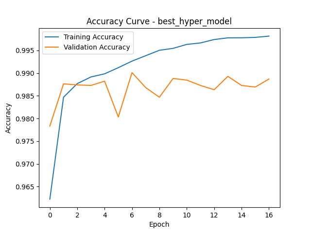
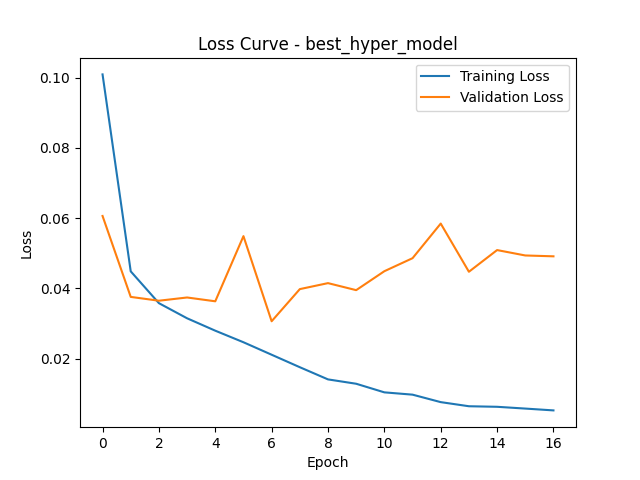

# BlinkSpeak: Blink to Text Assistive Interface


> **"Giving a voice to those who can only speak with their eyes."**

**BlinkSpeak** is a real time assistive technology designed for individuals with motor impairments (such as **ALS** or **Locked-in Syndrome**). It serves as an affordable, software based alternative to expensive eye tracking hardware.

Using a standard webcam, BlinkSpeak employs a custom **11 layer Convolutional Neural Network (CNN)** to detect voluntary eye blinks, a deterministic state machine to translate them into **Morse Code**, and an **AI Prediction Engine** (GPT-2) to anticipate and auto complete sentences seamlessly.

---
## Demo Video - Click the Image
<p align="center">
  <a href="https://youtu.be/qCHumGJI3x0">
    
  </a>
</p>

---

## Key Features

* **Hardware Agnostic:** Works on any standard laptop webcam, no specialized sensors required.
* **High Accuracy CNN:** Powered by a custom PyTorch model trained on **85,000+ images**, achieving **99.06% validation accuracy**.
* **Zero Lag Architecture:** Implements threaded background workers for video capture and AI generation, keeping the camera running at a flawless 30+ FPS.
* **Auditory "Blind Mode" Feedback:** A 3 beep progressive audio system allows users to time their blinks perfectly without ever needing to look at the screen.
* **AI Smart Prediction:** Uses a hybrid local dictionary and **GPT-2 Large** model to provide real time word suggestions and autocomplete.
* **Text-to-Speech (TTS):** An asynchronous background audio engine speaks the translated sentences aloud upon command.

---

## System Architecture

The system follows a modular pipeline:
1. **Input Stream:** Captures video frames continuously in the background.
2. **Vision Processing:** MediaPipe precise landmark tracking and grayscale ROI extraction.
3. **Deep Learning:** CNN Binary Classifier identifies "Open" vs. "Closed" eye states.
4. **Time Encoding:** Measures blink duration against the "Blind Mode" audio cues to determine Intentional Blinks (Dots/Dashes).
5. **AI Prediction:** Background GPT-2 worker calculates the next word in the sequence.
6. **Audio/Text Synthesis:** Converts sequences into characters, displays UI, and vocalizes the output.

---

## Installation & Setup

### Option 1: Quick Start (Windows Standalone)
If you just want to use the application without writing code, you can download the compiled `.exe`.
1. Go to the **Releases** section of this repository.
2. Download `BlinkSpeak.zip`.
3. Extract the folder, double click `BlinkSpeak.exe`, and start typing.*

### Option 2: Developer Setup
If you want to run the raw Python code or contribute to the project:

#### Prerequisites
* **Python 3.10** (Crucial for MediaPipe compatibility)
* Webcam

#### 1. Clone the Repository
```bash
git clone [https://github.com/Prateek-845/BlinkSpeak.git](https://github.com/Prateek-845/BlinkSpeak.git)
cd BlinkSpeak
```
#### 2. Create a Virtual Environment
It is highly recommended to use a virtual environment to avoid version conflicts.

**Windows:**
```bash
py -3.10 -m venv venv
.\venv\Scripts\activate
```
**Linux/Mac:**
```bash
python3.10 -m venv venv
source venv/bin/activate
```
#### 3. Install Dependencies
```bash
pip install -r requirements.txt
```
#### 4. Usage
Run the main application script:
```bash
python main.py
```

---

### Controls & Blink Timings
The system distinguishes signals based on blink duration. Listen to the background beeps to time your inputs:

| Action | Audio Cue / Duration | Description |
| :--- | :--- | :--- |
| **DOT (`.`)** | **1st Beep** (~0.3s) | Open eyes immediately after the first beep. |
| **DASH (`-`)** | **2nd Beep** (~1.0s) | Hold blink until the second beep, then open. |
| **ACCEPT AI WORD** | **3rd Beep** (~2.0s) | Hold blink until the third beep to accept the grey AI suggestion. |
| **CHARACTER PAUSE**| 3.0s Pause | Keep eyes open for 3 seconds to confirm the current Morse sequence. |

**Custom System Commands:**
* **`[SPACE]`** (`..--`): Adds a space between words.
* **`[BACKSPACE]`** (`----`): Deletes the last character typed.
* **`[NEWLINE]`** (`.-.-`): Saves text to `output.txt` and speaks the sentence aloud.
* **`[CLEAR]`** (`---.`): Wipes the entire current message buffer.
* **Exit**: Press the `Q` key to safely shut down the application.

---

### Project Structure
```text
BlinkSpeak/
├── main.py              # Main application with threaded UI & video stream
├── vision_utils.py      # MediaPipe & eye ROI processing
├── audio_utils.py       # Asynchronous TTS & auditory beep feedback
├── blink_predictor.py   # GPT-2 Large & Dictionary word prediction
├── morse_dict.py        # Optimized Morse code dictionary mappings
├── common_words.txt     # English dictionary for rapid autocomplete
├── requirements.txt     # Project dependencies
├── dataset_train_tune_codes/ # Source scripts for building the CNN
└── results/             # Stores the trained model weights (.pth)
```

---
## Model Performance & Evaluation

The core visual engine of **BlinkSpeak** is a custom **11 Layer Convolutional Neural Network (CNN)** optimized for binary eye state classification. The model was trained on the **MRL Eye Dataset** (85,000+ near infrared images) and achieved exceptional performance metrics, ensuring reliability for real time communication.

### Key Metrics
| Metric | Score | Description |
| :--- | :--- | :--- |
| **Test Accuracy** | **99.00%** | Correctly classified 99% of unseen images. |
| **Validation Accuracy** | **99.06%** | Peak accuracy during hyperparameter tuning. |
| **AUC Score** | **0.9994** | Near-perfect class separability (1.0 is perfect). |
| **F1-Score** | **0.9901** | Balanced precision and recall for both open/closed states. |
| **Inference Speed** | **~30 FPS** | Optimized for real time CPU performance. |

---

### Hyperparameter Optimization
I conducted an extensive Grid Search to fine-tune the model. The best configuration significantly reduced overfitting:

* **Architecture:** Custom 11 Layer CNN 
* **Optimizer:** Adam
* **Learning Rate:** `0.0001`
* **Dropout Rate:** `0.4` 
* **Batch Size:** `64`

---

### Confusion Matrix Analysis
The model demonstrates high resilience to "flickering" (false state changes). Out of **8,490 test samples**, the model made only **85 errors**:

| | **Predicted Closed** | **Predicted Open** |
| :--- | :---: | :---: |
| **Actual Closed** | **4136** (True Negatives) | 58 (False Positives) |
| **Actual Open** | 27 (False Negatives) | **4269** (True Positives) |

> **Insight:** The False Negative rate is extremely low (27/4296), meaning the system rarely misses an intentional blink, which is critical for accurate Morse code typing.

---

### Classification Report
The model shows no bias towards either class, performing equally well for both open and closed eyes.

| Class | Precision | Recall | F1-Score | Support |
| :--- | :---: | :---: | :---: | :---: |
| **Closed Eyes** | 0.99 | 0.99 | 0.99 | 4194 |
| **Open Eyes** | 0.99 | 0.99 | 0.99 | 4296 |
| **Weighted Avg** | **0.99** | **0.99** | **0.99** | **8490** |

---

### Performance Visualizations

| Accuracy Curve | Loss Curve |
| :---: | :---: |
|  |  |

> **Note:** The convergence of Training (Blue) and Validation (Orange) lines indicates robust generalization with minimal overfitting.

---

### License
This project is open-source and available for educational and assistive purposes.
